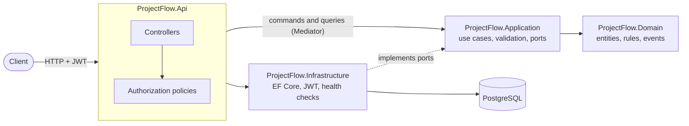
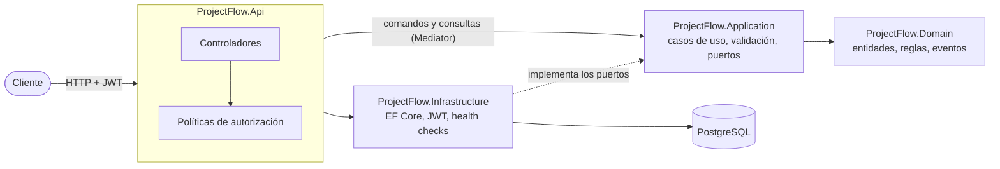

# ProjectFlow API

**English** | [Español](#español)

Enterprise REST API for software project management (mini-Jira): organizations, projects, sprints, epics, tasks, comments and labels, with JWT authentication, role-based access control, an audit log and task search.

**Live demo**: [projectflow-api-8ybj.onrender.com/scalar](https://projectflow-api-8ybj.onrender.com/scalar), the interactive API reference in English or Spanish. Log in with any [demo user](#demo-data) (password `ProjectFlow-Dev-2026`) and try every endpoint. The data is fictional and restored every day; after a quiet period the first request takes about a minute while the free service wakes up.

**What it shows**: Clean Architecture with CQRS, a rich domain model, security by default (every endpoint authenticated, roles checked against the database on every request, organizations isolated from each other), consistency under concurrency, an insert-only audit log, structured logs, a bilingual interactive API reference, and more than 500 tests against a real PostgreSQL.

## Contents

- [Features](#features)
- [Architecture](#architecture)
- [Key decisions](#key-decisions)
- [Getting started](#getting-started)
- [API tour](#api-tour)
- [Domain rules](#domain-rules)
- [Roles and permissions](#roles-and-permissions)
- [Errors](#errors)
- [Tests and quality](#tests-and-quality)
- [License](#license)

## Features

| Area | What the API does |
|---|---|
| Accounts | Register, log in, renew tokens with rotation, log out (RF-01) |
| Organizations | Several organizations per user, `Admin` and `Member` roles, isolated data (RF-02) |
| Projects | Project roles (project manager, developer, viewer), archive, soft delete (RF-03) |
| Tasks | Keys per project (`WEB-12`), type, priority, story points, assignee, sprint, epic (RF-04, RF-06) |
| Workflow | `ToDo` → `InProgress` → `Review` → `Done`, reopen by managers (RF-07, RF-08) |
| Sprints and epics | One active sprint per project, epic progress (RF-05) |
| Collaboration | Comments in any language, labels (RF-09) |
| Audit | Who changed what and when, insert-only (RF-10) |
| Search | Filters, text ignoring case and accents, sorting, pages (RF-11) |
| Operations | JSON logs with correlation id, health check with database, API reference in English and Spanish |

## Architecture

Four projects with dependencies pointing inward only. `ProjectFlow.ArchitectureTests` fails the build if a layer references one it must not.



| Project | Responsibility |
|---|---|
| `ProjectFlow.Domain` | Entities and value objects, business rules (workflow, last admin, one active sprint…), the permission matrix and activity events. No dependencies. |
| `ProjectFlow.Application` | One use case per command or query (Mediator), FluentValidation validators, ports (`IUnitOfWork`, repositories, `ICurrentUser`…). Returns `Result`s, never throws for expected failures. |
| `ProjectFlow.Infrastructure` | EF Core with PostgreSQL (migrations, global filters, constraints), JWT and refresh tokens, password hashing, demo data, health checks. |
| `ProjectFlow.Api` | Controllers, authorization policies, ProblemDetails, OpenAPI and Scalar, logging. |

**A request, step by step**: the controller receives it → the authorization policy resolves the user's organization and project role from the database (404 if they cannot see it, 403 if they lack the permission) → Mediator runs the validators and the handler → the handler loads the aggregate and calls the domain → `IUnitOfWork` saves the change and its activity log rows in one transaction → the controller maps the `Result` to the response or to a ProblemDetails.

```
src/
  ProjectFlow.Domain
  ProjectFlow.Application
  ProjectFlow.Infrastructure
  ProjectFlow.Api
tests/
  ProjectFlow.Domain.Tests           Business rules, no I/O
  ProjectFlow.Application.Tests      Use cases and validators, no I/O
  ProjectFlow.Infrastructure.Tests   EF Core model, filters, demo data (PostgreSQL)
  ProjectFlow.Api.IntegrationTests   The real API over HTTP (PostgreSQL)
  ProjectFlow.ArchitectureTests      Layer dependencies
docs/
  adr/                Architecture decision records
  tech-debt.md        Shortcuts accepted on purpose
  engineering-workflow.md
```

## Key decisions

Each decision is recorded with its context, options and consequences in [`docs/adr`](docs/adr/README.md).

| Decision | Why |
|---|---|
| **.NET 10 (LTS) and PostgreSQL** ([ADR 0001](docs/adr/0001-dotnet-10-and-postgresql.md)) | Long-term support; PostgreSQL gives partial unique indexes, row locks, triggers and `unaccent`, all used by the rules below. |
| **Clean Architecture with CQRS** ([ADR 0003](docs/adr/0003-clean-architecture-with-cqrs.md)) | Rules live in the domain and are tested without a database; each use case is one small handler. |
| **Mediator instead of MediatR** ([ADR 0002](docs/adr/0002-mediator-instead-of-mediatr.md)) | MediatR moved to a dual RPL/commercial license (v13). Mediator is MIT and uses a source generator: no reflection at runtime. |
| **Roles resolved on every request, never in the token** ([ADR 0004](docs/adr/0004-roles-resolved-per-request.md)) | A role change or removal takes effect immediately, without waiting for tokens to expire. The token carries only the user's identity. |
| **Multi-organization isolation** | Every organization-owned row carries `organization_id`; EF Core global query filters add it to every query; composite foreign keys `(project_id, organization_id)` stop a row from pointing at another organization's project; users who are not members get 404, so they cannot even tell an organization exists. |
| **Soft delete for projects and tasks** | Deleted projects and tasks are hidden by a global filter but kept, so the audit log keeps its history and task keys are never reused. Everything else is deleted for good. |
| **Refresh token rotation** ([ADR 0005](docs/adr/0005-refresh-token-rotation.md)) | Each refresh token works once; reusing one revokes the whole session (theft detection). Only a SHA-256 hash is stored. |
| **Insert-only activity log** ([ADR 0006](docs/adr/0006-insert-only-activity-log.md)) | Domain events become log rows in the same transaction as the change; a database trigger rejects updates and deletes. |
| **Consistency under concurrency** | Task numbers are allocated under a row lock (no duplicates); a partial unique index allows one active sprint per project; optimistic concurrency answers 409. |
| **Expected failures are `Result`s** | Business errors are values with a stable `code`, mapped in one place to the HTTP status; exceptions are only for the unexpected. |
| **API reference in two languages** ([ADR 0007](docs/adr/0007-api-reference-with-openapi-and-scalar.md), [ADR 0008](docs/adr/0008-bilingual-api-reference-catalog.md)) | Built-in OpenAPI and Scalar; who can call each endpoint is generated from the real authorization, and every error code is explained. |
| **Structured logging** ([ADR 0009](docs/adr/0009-structured-logging-with-serilog.md)) | Serilog JSON with a correlation id equal to the error `traceId`; no bodies, headers or query strings. |

## Getting started

With Docker (API + PostgreSQL, no other setup needed):

```bash
docker compose up --build
```

The API listens on http://localhost:5080: open it in the browser for the **interactive API reference** (Scalar), in English or Spanish, where every endpoint explains what it does, who can call it, each error code it can return and example requests and responses, and can be tried (log in, then paste the access token as Bearer token). The OpenAPI documents are at `/openapi/en.json` and `/openapi/es.json`; the reference exists in Development only. Health check: `GET /health`. Local defaults can be overridden with a `.env` file based on `.env.example`.

With the [.NET 10 SDK](https://dotnet.microsoft.com/download), start only the database with Docker and the API with the SDK:

```bash
docker compose up -d db
dotnet user-secrets set ConnectionStrings:Default "Host=localhost;Port=5432;Database=projectflow;Username=projectflow;Password=projectflow_dev" --project src/ProjectFlow.Api
dotnet run --project src/ProjectFlow.Api
```

Docker Compose applies the database migrations and loads the demo data on startup. The JWT signing key comes from configuration (`Jwt:SigningKey`, at least 32 characters, through user-secrets or environment variables, never committed); in Development a random one is generated if none is set.

### Demo data

In Development, Docker Compose loads fictional demo data once: two organizations (**Acme Software** and **Globex Corporation**), three projects with sprints, epics, labels, tasks in every status and comments. Every demo user signs in with the password `ProjectFlow-Dev-2026` (local development only):

| User | Role |
|---|---|
| ana.admin@example.com | Acme admin |
| bruno.pm@example.com | Project manager (WEB, MOB) |
| carla.dev@example.com | Developer at Acme, viewer at Globex |
| diego.dev@example.com | Developer (WEB) |
| elena.viewer@example.com | Viewer (WEB) |
| frank.admin@example.com | Globex admin, project manager (DATA) |
| grace.dev@example.com | Developer (DATA) |

### Public demo (Render + Neon)

[`render.yaml`](render.yaml) describes the public demo: the Docker image on a free [Render](https://render.com) web service and PostgreSQL on a free [Neon](https://neon.com) project ([ADR 0010](docs/adr/0010-public-demo-on-render-and-neon.md)). The demo runs in Production with the API reference turned on, the demo data above, and a **daily reset** that restores that data. It sleeps after 15 minutes without traffic, so the first request after a pause takes about a minute. Render deploys `main` only when CI is green.

To deploy your own copy:

1. Create a free project on Neon (PostgreSQL 17) and copy its **direct** connection string (not the pooled one) in .NET format: `Host=<host>;Database=<db>;Username=<user>;Password=<password>;SSL Mode=Require`.
2. On Render choose **New → Blueprint** and connect this repository. Render reads `render.yaml`, generates the JWT signing key and asks for `ConnectionStrings__Default`: paste the Neon connection string. No secret is stored in the repository.
3. The first deploy applies the migrations and loads the demo data. The reference is at `https://<service>.onrender.com/scalar` and the health check at `/health`.

## API tour

Real requests and responses against the demo data (ids shortened).

**Log in** and keep the access token:

```bash
curl -X POST http://localhost:5080/api/auth/login -H "Content-Type: application/json" \
  -d '{"email":"bruno.pm@example.com","password":"ProjectFlow-Dev-2026"}'
```

```json
{
  "accessToken": "eyJhbGciOiJIUzI1NiIs…",
  "tokenType": "Bearer",
  "expiresAt": "2026-10-08T02:09:57+00:00",
  "refreshToken": "6sfBYrhu_gazk5iMYsut…",
  "refreshTokenExpiresAt": "2026-10-15T01:54:57+00:00"
}
```

**Your organizations and projects** (start here to get the ids):

```bash
curl http://localhost:5080/api/organizations -H "Authorization: Bearer $TOKEN"
curl http://localhost:5080/api/organizations/$ORG/projects -H "Authorization: Bearer $TOKEN"
```

```json
[{ "id": "01a10e55-…-e6d377f4b2e9", "name": "Acme Software", "slug": "acme-software", "role": "Member" }]
[{ "id": "01a10e55-…-ecb064833352", "key": "MOB", "name": "ProjectFlow Mobile", "isArchived": false, "myRole": "ProjectManager" },
 { "id": "01a10e55-…-fd843ff3d402", "key": "WEB", "name": "ProjectFlow Web", "isArchived": false, "myRole": "ProjectManager" }]
```

**Search tasks**: text ignoring case, two statuses, newest key first, one per page:

```bash
curl "http://localhost:5080/api/organizations/$ORG/projects/$WEB/tasks?q=LOGIN&status=InProgress&status=ToDo&sort=-number&pageSize=1" \
  -H "Authorization: Bearer $TOKEN"
```

```json
{
  "items": [{
    "id": "01a10f33-…-a59659b89d4d", "key": "WEB-12", "number": 12, "title": "Typo on login page",
    "description": null, "type": "Bug", "priority": "Low", "status": "ToDo", "storyPoints": null,
    "reporterId": "01a10e55-…-c72f6885ef8d", "assigneeId": null, "sprintId": null, "epicId": null,
    "labelIds": [], "createdAt": "2026-10-06T03:12:59+00:00", "updatedAt": "2026-10-06T03:12:59+00:00"
  }],
  "page": 1, "pageSize": 1, "totalCount": 2, "totalPages": 2, "hasNextPage": true
}
```

**A business rule says no**: a task cannot jump from `ToDo` to `Done`:

```bash
curl -X POST http://localhost:5080/api/organizations/$ORG/projects/$WEB/tasks/$TASK/status \
  -H "Authorization: Bearer $TOKEN" -H "Content-Type: application/json" -d '{"status":"Done"}'
```

```json
HTTP/1.1 422 Unprocessable Entity
Content-Type: application/problem+json

{ "title": "A task cannot move from ToDo to Done.", "status": 422, "code": "Task.InvalidTransition", "traceId": "00-1df4ed41826c2bb518e4182014ff878d-…" }
```

**Outsiders see nothing**: an organization you do not belong to looks like one that does not exist:

```json
HTTP/1.1 404 Not Found

{ "title": "The organization does not exist.", "status": 404, "code": "Organization.NotFound", "traceId": "00-272871df3927129d1f9cb719211a682c-…" }
```

The interactive reference lists every endpoint with the same level of detail.

## Domain rules

**Authentication.** Every endpoint requires a JWT access token except registration, login, refresh, logout and the health check. Access tokens last 15 minutes and carry only the user's identity. Login also returns a refresh token (7 days): `POST /api/auth/refresh` exchanges it for a new pair and it works only once; replaying a used one revokes the whole session. `POST /api/auth/logout` ends the session.

**Organizations** (`/api/organizations`). Whoever creates an organization becomes its admin; admins add members by e-mail, change roles and remove members; any member can leave. The last admin can never be removed or demoted.

**Projects** (`.../organizations/{organizationId}/projects`). Organization admins create them (and become their project manager) and can soft-delete them; project managers edit, archive (read-only) and manage project members, who must belong to the organization. Keys like `WEB` are unique within the organization and stay reserved after deletion.

**Sprints** go `Planned` → `Active` → `Completed`; a project has at most one active sprint (RF-05), enforced by the domain and by a partial unique index. Completing a sprint sends its unfinished tasks back to the backlog. **Epics** group tasks and show their progress; a closed epic accepts no new tasks.

**Tasks** get sequential keys per project (`WEB-12`), safe under concurrent creation. They have a type, priority, story points (0–100), an assignee (someone who works in the project), a sprint (or the backlog) and an epic. Status follows `ToDo` → `InProgress` → `Review` → `Done`, with `Review` → `InProgress` as the only step back (RF-07); done tasks are read-only until a project manager or admin reopens them (RF-08). Developers change only tasks they reported or are assigned to; only project managers delete tasks (soft delete).

**Search** (RF-11): `GET .../tasks` filters by `status` (repeatable), `assigneeId` or `unassigned=true`, `sprintId` or `backlog=true`, `epicId`, `labelId` and `q`, which matches title words ignoring case and accents (`validacion` finds "Validación") or a key (`WEB-12`). Results are sorted (`sort=number|-number|updatedAt|-updatedAt`) and paged (`page`, `pageSize` up to 100).

**Comments** (RF-09) accept any language and Unicode text (accents, ñ, emoji); viewers read but do not comment; only the author edits a comment; the author or a project manager deletes it. **Labels** are managed by project managers (names unique per project, ignoring case) and added to tasks with `PUT/DELETE .../tasks/{taskId}/labels/{labelId}`.

**Activity log** (RF-10): every relevant change is recorded with who, what, when, old and new value, in the same transaction as the change, so a rejected change leaves no trace. Project managers and admins read it at `.../projects/{projectId}/activity` (`?entityId=` for the history of one task). A database trigger rejects any update or delete.

**Logs and health.** Logs are structured JSON on the console (Serilog): one line per request with method, path, status and duration, and a `CorrelationId` on every line. The correlation id is returned in the `X-Correlation-Id` header and equals the `traceId` of error responses, so an error a client reports can be found in the logs. Bodies, headers and query strings are never logged. `GET /health` answers `Healthy` (200) or `Unhealthy` (503) and checks that PostgreSQL is reachable. Log levels are set in the `Serilog` section of `appsettings.json`.

## Roles and permissions

| Action | Org admin | Project manager | Developer | Viewer |
|---|---|---|---|---|
| View project and tasks | ✅ | ✅ | ✅ | ✅ |
| Create and edit projects, manage project members | ✅ | ✅ | | |
| Manage sprints, epics and labels | ✅ | ✅ | | |
| Create tasks, comment | ✅ | ✅ | ✅ | |
| Edit and move tasks | ✅ any | ✅ any | own or assigned | |
| Delete and reopen tasks, view activity log | ✅ | ✅ | | |

Organization admins have every permission in every project of their organization; other members only see projects where they have a role. The matrix lives in the domain (`ProjectPermissions`) and the API reference is generated from it.

## Errors

Every error is [RFC 9457](https://www.rfc-editor.org/rfc/rfc9457) ProblemDetails (`application/problem+json`) with a stable `code` to branch on and a `traceId` to find the request in the logs:

| Status | Meaning |
|---|---|
| 400 | Invalid request; `errors` lists the problems per field |
| 401 / 403 | Not authenticated / not allowed |
| 404 | Not found, or not visible to the current user |
| 405 | The route exists but not with this HTTP method (the `Allow` header lists the valid ones) |
| 409 | Conflicts with existing data (duplicate value, concurrent change) |
| 422 | Valid request that breaks a business rule |

## Tests and quality

```bash
dotnet test                                       # every test project
dotnet test --filter "FullyQualifiedName~Tasks"   # a subset
```

Tests that need a database start a throwaway PostgreSQL 17 with **Testcontainers**, so **Docker must be running**. There is no in-memory database: constraints, triggers, locks and query filters are tested for real.

| Project | What it covers |
|---|---|
| `ProjectFlow.Domain.Tests` | Business rules: workflow, permissions matrix, sprints, last admin, validation |
| `ProjectFlow.Application.Tests` | Use cases and validators with fakes |
| `ProjectFlow.Infrastructure.Tests` | EF Core model (and missing migrations), query filters, demo data |
| `ProjectFlow.Api.IntegrationTests` | Every endpoint over HTTP: permissions per role, isolation between organizations, concurrency (task numbers, active sprint, refresh tokens), activity log, search, API reference, logs |
| `ProjectFlow.ArchitectureTests` | Layer dependencies |

Every pull request runs in CI (GitHub Actions): formatting, build with **warnings as errors**, all tests with a coverage summary, the Docker image, vulnerable NuGet packages and a secret scan (gitleaks). Dependabot proposes updates every week. Every change follows the two gates of [`docs/engineering-workflow.md`](docs/engineering-workflow.md) (plan before coding, review checklist after), and shortcuts accepted on purpose are tracked in [`docs/tech-debt.md`](docs/tech-debt.md).

## License

[MIT](LICENSE) © 2026 Julian Stiven Londoño Perez. You can use, copy and modify the code, keeping the copyright notice.

---

## Español

API REST empresarial para gestionar proyectos de software (estilo mini-Jira): organizaciones, proyectos, sprints, épicas, tareas, comentarios y etiquetas, con autenticación JWT, control de acceso por roles, registro de auditoría y búsqueda de tareas.

**Demo en vivo**: [projectflow-api-8ybj.onrender.com/scalar](https://projectflow-api-8ybj.onrender.com/scalar), la referencia interactiva de la API en inglés o español. Inicia sesión con cualquier [usuario de ejemplo](#datos-de-ejemplo) (contraseña `ProjectFlow-Dev-2026`) y prueba cada endpoint. Los datos son ficticios y se restauran cada día; tras un rato sin uso, la primera petición tarda alrededor de un minuto mientras el servicio gratis despierta.

**Qué demuestra**: Clean Architecture con CQRS, un modelo de dominio rico, seguridad por defecto (todos los endpoints autenticados, roles comprobados contra la base de datos en cada petición, organizaciones aisladas entre sí), consistencia ante concurrencia, un registro de auditoría solo de inserción, logs estructurados, una referencia interactiva de la API bilingüe y más de 500 pruebas contra un PostgreSQL real.

### Contenido

- [Funcionalidades](#funcionalidades)
- [Arquitectura](#arquitectura)
- [Decisiones clave](#decisiones-clave)
- [Cómo ejecutarlo](#cómo-ejecutarlo)
- [Recorrido por la API](#recorrido-por-la-api)
- [Reglas del dominio](#reglas-del-dominio)
- [Roles y permisos](#roles-y-permisos)
- [Errores](#errores)
- [Pruebas y calidad](#pruebas-y-calidad)
- [Licencia](#licencia)

### Funcionalidades

| Área | Qué hace la API |
|---|---|
| Cuentas | Registro, login, renovación de tokens con rotación, cierre de sesión (RF-01) |
| Organizaciones | Varias organizaciones por usuario, roles `Admin` y `Member`, datos aislados (RF-02) |
| Proyectos | Roles de proyecto (jefe de proyecto, desarrollador, observador), archivado, borrado lógico (RF-03) |
| Tareas | Claves por proyecto (`WEB-12`), tipo, prioridad, puntos, responsable, sprint, épica (RF-04, RF-06) |
| Flujo | `ToDo` → `InProgress` → `Review` → `Done`, reapertura por los jefes (RF-07, RF-08) |
| Sprints y épicas | Un sprint activo por proyecto, progreso de las épicas (RF-05) |
| Colaboración | Comentarios en cualquier idioma, etiquetas (RF-09) |
| Auditoría | Quién cambió qué y cuándo, solo de inserción (RF-10) |
| Búsqueda | Filtros, texto sin distinguir mayúsculas ni tildes, orden, páginas (RF-11) |
| Operación | Logs JSON con correlation id, health check con base de datos, referencia de la API en inglés y español |

### Arquitectura

Cuatro proyectos con dependencias que solo apuntan hacia dentro. `ProjectFlow.ArchitectureTests` hace fallar la compilación si una capa referencia a otra que no debe.



| Proyecto | Responsabilidad |
|---|---|
| `ProjectFlow.Domain` | Entidades y objetos de valor, reglas de negocio (flujo, último admin, un sprint activo…), la matriz de permisos y los eventos de actividad. Sin dependencias. |
| `ProjectFlow.Application` | Un caso de uso por comando o consulta (Mediator), validadores de FluentValidation, puertos (`IUnitOfWork`, repositorios, `ICurrentUser`…). Devuelve `Result`, nunca lanza excepciones para fallos esperados. |
| `ProjectFlow.Infrastructure` | EF Core con PostgreSQL (migraciones, filtros globales, restricciones), JWT y refresh tokens, hash de contraseñas, datos de ejemplo, health checks. |
| `ProjectFlow.Api` | Controladores, políticas de autorización, ProblemDetails, OpenAPI y Scalar, logs. |

**Una petición, paso a paso**: el controlador la recibe → la política de autorización resuelve desde la base de datos el rol del usuario en la organización y en el proyecto (404 si no puede verlo, 403 si le falta el permiso) → Mediator ejecuta los validadores y el handler → el handler carga el agregado y llama al dominio → `IUnitOfWork` guarda el cambio y sus filas del registro de actividad en una sola transacción → el controlador convierte el `Result` en la respuesta o en un ProblemDetails.

```
src/
  ProjectFlow.Domain
  ProjectFlow.Application
  ProjectFlow.Infrastructure
  ProjectFlow.Api
tests/
  ProjectFlow.Domain.Tests           Reglas de negocio, sin E/S
  ProjectFlow.Application.Tests      Casos de uso y validadores, sin E/S
  ProjectFlow.Infrastructure.Tests   Modelo de EF Core, filtros, datos de ejemplo (PostgreSQL)
  ProjectFlow.Api.IntegrationTests   La API real por HTTP (PostgreSQL)
  ProjectFlow.ArchitectureTests      Dependencias entre capas
docs/
  adr/                Registros de decisiones de arquitectura
  tech-debt.md        Atajos aceptados a propósito
  engineering-workflow.md
```

### Decisiones clave

Cada decisión está registrada con su contexto, opciones y consecuencias en [`docs/adr`](docs/adr/README.md).

| Decisión | Por qué |
|---|---|
| **.NET 10 (LTS) y PostgreSQL** ([ADR 0001](docs/adr/0001-dotnet-10-and-postgresql.md)) | Soporte a largo plazo; PostgreSQL ofrece índices únicos parciales, bloqueos de fila, triggers y `unaccent`, que usan las reglas de abajo. |
| **Clean Architecture con CQRS** ([ADR 0003](docs/adr/0003-clean-architecture-with-cqrs.md)) | Las reglas viven en el dominio y se prueban sin base de datos; cada caso de uso es un handler pequeño. |
| **Mediator en lugar de MediatR** ([ADR 0002](docs/adr/0002-mediator-instead-of-mediatr.md)) | MediatR pasó a una licencia dual RPL/comercial (v13). Mediator es MIT y usa un generador de código: sin reflexión en tiempo de ejecución. |
| **Roles resueltos en cada petición, nunca en el token** ([ADR 0004](docs/adr/0004-roles-resolved-per-request.md)) | Un cambio de rol o una baja se aplican al instante, sin esperar a que caduquen los tokens. El token solo lleva la identidad del usuario. |
| **Aislamiento entre organizaciones** | Cada fila que pertenece a una organización lleva `organization_id`; los filtros globales de EF Core lo añaden a cada consulta; las claves foráneas compuestas `(project_id, organization_id)` impiden que una fila apunte a un proyecto de otra organización; quien no es miembro recibe 404, así que ni siquiera sabe si una organización existe. |
| **Borrado lógico de proyectos y tareas** | Los proyectos y tareas borrados se ocultan con un filtro global pero se conservan, así el registro de auditoría mantiene su historia y las claves de tarea nunca se reutilizan. Todo lo demás se borra definitivamente. |
| **Rotación de refresh tokens** ([ADR 0005](docs/adr/0005-refresh-token-rotation.md)) | Cada refresh token sirve una vez; reutilizar uno revoca toda la sesión (detección de robo). Solo se guarda un hash SHA-256. |
| **Registro de actividad solo de inserción** ([ADR 0006](docs/adr/0006-insert-only-activity-log.md)) | Los eventos de dominio se convierten en filas del registro en la misma transacción que el cambio; un trigger de la base de datos rechaza modificaciones y borrados. |
| **Consistencia ante concurrencia** | Los números de tarea se asignan bajo un bloqueo de fila (sin duplicados); un índice único parcial permite un solo sprint activo por proyecto; la concurrencia optimista responde 409. |
| **Los fallos esperados son `Result`** | Los errores de negocio son valores con un `code` estable, convertidos en un solo lugar al estado HTTP; las excepciones quedan para lo inesperado. |
| **Referencia de la API en dos idiomas** ([ADR 0007](docs/adr/0007-api-reference-with-openapi-and-scalar.md), [ADR 0008](docs/adr/0008-bilingual-api-reference-catalog.md)) | OpenAPI integrado y Scalar; quién puede llamar a cada endpoint se genera a partir de la autorización real, y cada código de error está explicado. |
| **Logs estructurados** ([ADR 0009](docs/adr/0009-structured-logging-with-serilog.md)) | JSON con Serilog y un correlation id igual al `traceId` de los errores; sin cuerpos, cabeceras ni query strings. |

### Cómo ejecutarlo

Con Docker (API + PostgreSQL, sin más configuración):

```bash
docker compose up --build
```

La API queda en http://localhost:5080: ábrela en el navegador para ver la **referencia interactiva de la API** (Scalar), en inglés o en español, donde cada endpoint explica qué hace, quién puede llamarlo, cada código de error que puede devolver y ejemplos de petición y respuesta, y se puede probar (haz login y pega el access token como Bearer token). Los documentos OpenAPI están en `/openapi/en.json` y `/openapi/es.json`; la referencia solo existe en Development. Health check: `GET /health`. Los valores locales por defecto se pueden cambiar con un archivo `.env` basado en `.env.example`.

Con el [SDK de .NET 10](https://dotnet.microsoft.com/download), levanta solo la base de datos con Docker y la API con el SDK:

```bash
docker compose up -d db
dotnet user-secrets set ConnectionStrings:Default "Host=localhost;Port=5432;Database=projectflow;Username=projectflow;Password=projectflow_dev" --project src/ProjectFlow.Api
dotnet run --project src/ProjectFlow.Api
```

Docker Compose aplica las migraciones y carga los datos de ejemplo al arrancar. La clave de firma de los JWT viene de la configuración (`Jwt:SigningKey`, mínimo 32 caracteres, mediante user-secrets o variables de entorno, nunca en el repositorio); en Development se genera una aleatoria si no hay ninguna.

#### Datos de ejemplo

En Development, Docker Compose carga una sola vez datos de ejemplo ficticios: dos organizaciones (**Acme Software** y **Globex Corporation**), tres proyectos con sprints, épicas, etiquetas, tareas en todos los estados y comentarios. Todos los usuarios de ejemplo entran con la contraseña `ProjectFlow-Dev-2026` (solo para desarrollo local):

| Usuario | Rol |
|---|---|
| ana.admin@example.com | Admin de Acme |
| bruno.pm@example.com | Jefe de proyecto (WEB, MOB) |
| carla.dev@example.com | Desarrolladora en Acme, observadora en Globex |
| diego.dev@example.com | Desarrollador (WEB) |
| elena.viewer@example.com | Observadora (WEB) |
| frank.admin@example.com | Admin de Globex, jefe de proyecto (DATA) |
| grace.dev@example.com | Desarrolladora (DATA) |

#### Demo pública (Render + Neon)

[`render.yaml`](render.yaml) describe la demo pública: la imagen Docker en un servicio web gratis de [Render](https://render.com) y PostgreSQL en un proyecto gratis de [Neon](https://neon.com) ([ADR 0010](docs/adr/0010-public-demo-on-render-and-neon.md)). La demo corre en Production con la referencia de la API activada, los datos de ejemplo de arriba y un **reinicio diario** que restaura esos datos. Se duerme tras 15 minutos sin tráfico, así que la primera petición después de una pausa tarda alrededor de un minuto. Render solo despliega `main` cuando el CI está en verde.

Para desplegar tu propia copia:

1. Crea un proyecto gratis en Neon (PostgreSQL 17) y copia su cadena de conexión **directa** (no la del pooler) en formato .NET: `Host=<host>;Database=<db>;Username=<usuario>;Password=<contraseña>;SSL Mode=Require`.
2. En Render elige **New → Blueprint** y conecta este repositorio. Render lee `render.yaml`, genera la clave de firma JWT y pide `ConnectionStrings__Default`: pega la cadena de conexión de Neon. No se guarda ningún secreto en el repositorio.
3. El primer despliegue aplica las migraciones y carga los datos de ejemplo. La referencia queda en `https://<servicio>.onrender.com/scalar` y el health check en `/health`.

### Recorrido por la API

Peticiones y respuestas reales contra los datos de ejemplo (ids acortados).

**Iniciar sesión** y guardar el access token:

```bash
curl -X POST http://localhost:5080/api/auth/login -H "Content-Type: application/json" \
  -d '{"email":"bruno.pm@example.com","password":"ProjectFlow-Dev-2026"}'
```

```json
{
  "accessToken": "eyJhbGciOiJIUzI1NiIs…",
  "tokenType": "Bearer",
  "expiresAt": "2026-10-08T02:09:57+00:00",
  "refreshToken": "6sfBYrhu_gazk5iMYsut…",
  "refreshTokenExpiresAt": "2026-10-15T01:54:57+00:00"
}
```

**Tus organizaciones y proyectos** (empieza aquí para obtener los ids):

```bash
curl http://localhost:5080/api/organizations -H "Authorization: Bearer $TOKEN"
curl http://localhost:5080/api/organizations/$ORG/projects -H "Authorization: Bearer $TOKEN"
```

```json
[{ "id": "01a10e55-…-e6d377f4b2e9", "name": "Acme Software", "slug": "acme-software", "role": "Member" }]
[{ "id": "01a10e55-…-ecb064833352", "key": "MOB", "name": "ProjectFlow Mobile", "isArchived": false, "myRole": "ProjectManager" },
 { "id": "01a10e55-…-fd843ff3d402", "key": "WEB", "name": "ProjectFlow Web", "isArchived": false, "myRole": "ProjectManager" }]
```

**Buscar tareas**: texto sin distinguir mayúsculas, dos estados, la clave más reciente primero, una por página:

```bash
curl "http://localhost:5080/api/organizations/$ORG/projects/$WEB/tasks?q=LOGIN&status=InProgress&status=ToDo&sort=-number&pageSize=1" \
  -H "Authorization: Bearer $TOKEN"
```

```json
{
  "items": [{
    "id": "01a10f33-…-a59659b89d4d", "key": "WEB-12", "number": 12, "title": "Typo on login page",
    "description": null, "type": "Bug", "priority": "Low", "status": "ToDo", "storyPoints": null,
    "reporterId": "01a10e55-…-c72f6885ef8d", "assigneeId": null, "sprintId": null, "epicId": null,
    "labelIds": [], "createdAt": "2026-10-06T03:12:59+00:00", "updatedAt": "2026-10-06T03:12:59+00:00"
  }],
  "page": 1, "pageSize": 1, "totalCount": 2, "totalPages": 2, "hasNextPage": true
}
```

**Una regla de negocio dice que no**: una tarea no puede saltar de `ToDo` a `Done`:

```bash
curl -X POST http://localhost:5080/api/organizations/$ORG/projects/$WEB/tasks/$TASK/status \
  -H "Authorization: Bearer $TOKEN" -H "Content-Type: application/json" -d '{"status":"Done"}'
```

```json
HTTP/1.1 422 Unprocessable Entity
Content-Type: application/problem+json

{ "title": "A task cannot move from ToDo to Done.", "status": 422, "code": "Task.InvalidTransition", "traceId": "00-1df4ed41826c2bb518e4182014ff878d-…" }
```

**Quien no es miembro no ve nada**: una organización a la que no perteneces parece una que no existe:

```json
HTTP/1.1 404 Not Found

{ "title": "The organization does not exist.", "status": 404, "code": "Organization.NotFound", "traceId": "00-272871df3927129d1f9cb719211a682c-…" }
```

La referencia interactiva muestra cada endpoint con el mismo nivel de detalle. Los mensajes (`title`) de la API están en inglés; la referencia en español explica cada `code`.

### Reglas del dominio

**Autenticación.** Todos los endpoints exigen un access token JWT, excepto el registro, el login, la renovación, el cierre de sesión y el health check. Los access tokens duran 15 minutos y solo llevan la identidad del usuario. El login también devuelve un refresh token (7 días): `POST /api/auth/refresh` lo cambia por un par nuevo y solo sirve una vez; reutilizar uno ya usado revoca toda la sesión. `POST /api/auth/logout` cierra la sesión.

**Organizaciones** (`/api/organizations`). Quien crea una organización es su admin; los admins añaden miembros por e-mail, cambian roles y quitan miembros; cualquier miembro puede salir. El último admin nunca puede ser eliminado ni degradado.

**Proyectos** (`.../organizations/{organizationId}/projects`). Los admins de la organización los crean (y quedan como jefe de proyecto) y pueden borrarlos (borrado lógico); los jefes de proyecto los editan, los archivan (solo lectura) y gestionan sus miembros, que deben pertenecer a la organización. Las claves como `WEB` son únicas dentro de la organización y quedan reservadas tras borrar el proyecto.

Los **sprints** pasan por `Planned` → `Active` → `Completed`; un proyecto tiene como máximo un sprint activo (RF-05), garantizado por el dominio y por un índice único parcial. Al completar un sprint, sus tareas sin terminar vuelven al backlog. Las **épicas** agrupan tareas y muestran su progreso; una épica cerrada no acepta tareas nuevas.

Las **tareas** reciben claves consecutivas por proyecto (`WEB-12`), seguras ante creaciones simultáneas. Tienen tipo, prioridad, puntos (0–100), responsable (alguien que trabaja en el proyecto), sprint (o backlog) y épica. El estado sigue `ToDo` → `InProgress` → `Review` → `Done`, con `Review` → `InProgress` como único retroceso (RF-07); las tareas terminadas son de solo lectura hasta que un jefe de proyecto o un admin las reabre (RF-08). Los desarrolladores solo cambian las tareas que crearon o tienen asignadas; solo los jefes de proyecto borran tareas (borrado lógico).

**Búsqueda** (RF-11): `GET .../tasks` filtra por `status` (repetible), `assigneeId` o `unassigned=true`, `sprintId` o `backlog=true`, `epicId`, `labelId` y `q`, que busca palabras del título sin distinguir mayúsculas ni tildes (`validacion` encuentra "Validación") o una clave (`WEB-12`). Los resultados se ordenan (`sort=number|-number|updatedAt|-updatedAt`) y se paginan (`page`, `pageSize` hasta 100).

Los **comentarios** (RF-09) admiten cualquier idioma y texto Unicode (tildes, ñ, emoji); los observadores los leen pero no comentan; solo el autor edita su comentario; lo borra el autor o un jefe de proyecto. Las **etiquetas** las gestionan los jefes de proyecto (nombres únicos por proyecto, sin distinguir mayúsculas) y se añaden a las tareas con `PUT/DELETE .../tasks/{taskId}/labels/{labelId}`.

**Registro de actividad** (RF-10): cada cambio relevante queda registrado con quién, qué, cuándo, valor anterior y nuevo, en la misma transacción que el cambio, así que un cambio rechazado no deja rastro. Lo leen los jefes de proyecto y los admins en `.../projects/{projectId}/activity` (`?entityId=` para el historial de una tarea). Un trigger de la base de datos rechaza cualquier modificación o borrado.

**Logs y salud.** Los logs son JSON estructurado en la consola (Serilog): una línea por petición con método, ruta, estado y duración, y un `CorrelationId` en cada línea. El correlation id se devuelve en la cabecera `X-Correlation-Id` y es igual al `traceId` de las respuestas de error, así que un error que reporta un cliente se encuentra en los logs. Nunca se registran cuerpos, cabeceras ni query strings. `GET /health` responde `Healthy` (200) o `Unhealthy` (503) y comprueba que PostgreSQL responde. Los niveles de log se configuran en la sección `Serilog` de `appsettings.json`.

### Roles y permisos

| Acción | Admin de la organización | Jefe de proyecto | Desarrollador | Observador |
|---|---|---|---|---|
| Ver el proyecto y sus tareas | ✅ | ✅ | ✅ | ✅ |
| Crear y editar proyectos, gestionar sus miembros | ✅ | ✅ | | |
| Gestionar sprints, épicas y etiquetas | ✅ | ✅ | | |
| Crear tareas, comentar | ✅ | ✅ | ✅ | |
| Editar y mover tareas | ✅ todas | ✅ todas | propias o asignadas | |
| Borrar y reabrir tareas, ver el registro de actividad | ✅ | ✅ | | |

Los admins de la organización tienen todos los permisos en todos sus proyectos; el resto de miembros solo ve los proyectos donde tiene un rol. La matriz vive en el dominio (`ProjectPermissions`) y la referencia de la API se genera a partir de ella.

### Errores

Todos los errores son ProblemDetails ([RFC 9457](https://www.rfc-editor.org/rfc/rfc9457), `application/problem+json`) con un `code` estable para decidir qué hacer y un `traceId` para encontrar la petición en los logs:

| Estado | Significado |
|---|---|
| 400 | Petición no válida; `errors` lista los problemas por campo |
| 401 / 403 | Sin autenticar / sin permiso |
| 404 | No existe, o el usuario actual no puede verlo |
| 405 | La ruta existe pero no con este método HTTP (la cabecera `Allow` lista los válidos) |
| 409 | Choca con datos existentes (valor duplicado, cambio concurrente) |
| 422 | Petición válida que incumple una regla de negocio |

### Pruebas y calidad

```bash
dotnet test                                       # todos los proyectos de pruebas
dotnet test --filter "FullyQualifiedName~Tasks"   # un subconjunto
```

Las pruebas que necesitan base de datos arrancan un PostgreSQL 17 desechable con **Testcontainers**, así que **Docker debe estar en marcha**. No hay base de datos en memoria: las restricciones, triggers, bloqueos y filtros de consulta se prueban de verdad.

| Proyecto | Qué cubre |
|---|---|
| `ProjectFlow.Domain.Tests` | Reglas de negocio: flujo, matriz de permisos, sprints, último admin, validación |
| `ProjectFlow.Application.Tests` | Casos de uso y validadores con dobles de prueba |
| `ProjectFlow.Infrastructure.Tests` | Modelo de EF Core (y migraciones que falten), filtros de consulta, datos de ejemplo |
| `ProjectFlow.Api.IntegrationTests` | Cada endpoint por HTTP: permisos por rol, aislamiento entre organizaciones, concurrencia (números de tarea, sprint activo, refresh tokens), registro de actividad, búsqueda, referencia de la API, logs |
| `ProjectFlow.ArchitectureTests` | Dependencias entre capas |

Cada pull request pasa por el CI (GitHub Actions): formato, compilación con **advertencias como errores**, todas las pruebas con un resumen de cobertura, la imagen Docker, paquetes NuGet con vulnerabilidades y un escaneo de secretos (gitleaks). Dependabot propone actualizaciones cada semana. Cada cambio sigue las dos puertas de [`docs/engineering-workflow.md`](docs/engineering-workflow.md) (plan antes de programar, lista de revisión después), y los atajos aceptados a propósito se registran en [`docs/tech-debt.md`](docs/tech-debt.md).

### Licencia

[MIT](LICENSE) © 2026 Julian Stiven Londoño Perez. Puedes usar, copiar y modificar el código, manteniendo el aviso de copyright.
